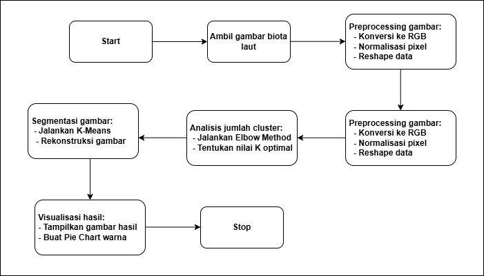
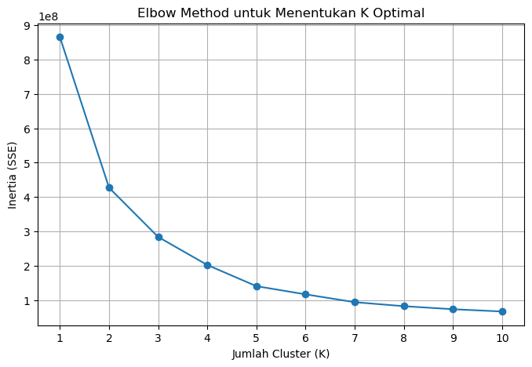
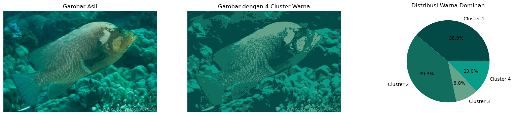

# Machine-Learning

Repositori Machine-Learning end-to-end: dari fundamental Python & data preprocessing, EDA, algoritma Machine Learning & Deep Learning, hingga deployment sederhana (Streamlit) dan praktik MLOps dasar.

Ringkasan singkat:
- Bahasa: Python
- Fokus: image processing, K-Means color segmentation, Elbow method, educational Pandas/Numpy workshops
- Demos: interactive Streamlit app (Projects/Final-Amarine-Assessment-2025/streamlit.py)
- Notebooks: analysis & tutorials (Projects/*/*.ipynb)

## Table of Contents
- [Why this repo](#why-this-repo)
- [Repository structure](#repository-structure)
- [Quickstart — run the Streamlit demo](#quickstart---run-the-streamlit-demo)
- [Run analysis notebooks](#run-analysis-notebooks)
- [Dependencies](#dependencies)
- [How the Final-Amarine project works (summary)](#how-the-final-amarine-project-works-summary)
- [Contributing](#contributing)
- [License & Contact](#license--contact)

---

## Why this repo
Tujuan repositori ini adalah menyediakan alur belajar praktis untuk:
1. Memahami dasar pemrograman & numerical computing (NumPy, Pandas).
2. Menjelajahi pipeline pemrosesan citra sederhana dan clustering warna (K-Means).
3. Mengembangkan demo deployable sederhana dengan Streamlit.
4. Menyimpan artefak pembelajaran: notebook latihan, dataset kecil, dan gambar contoh.

---

## Repository structure
At a glance:
- README.md (this file)
- Basic-Python/
  - basic1.ipynb (starter Python notebook)
- Projects/
  - Final-Amarine-Assessment-2025/
    - README.md (detailed project documentation)
    - notebook.ipynb (analysis & experiments)
    - streamlit.py (Streamlit demo)
    - images/ (diagram, elbow, kmeans, deploy, sample images)
  - Internship-data-science-2025/
    - Workshop_Pandas_Numpy/ (NumPy & Pandas workshop notebooks and titanic.csv)

---

## Quickstart — run the Streamlit demo
This demo performs K-Means color segmentation on uploaded marine life images and displays the recolored result + pie chart of dominant colors.

1. Clone the repository:
```bash
git clone https://github.com/ezra1702/Machine-Learning.git
cd Machine-Learning
```

2. Create a virtual environment (recommended) and install dependencies (example):
```bash
python -m venv .venv
source .venv/bin/activate   # macOS / Linux
.venv\Scripts\activate      # Windows

pip install --upgrade pip
pip install streamlit scikit-learn pillow matplotlib numpy opencv-python
```
Optional: create a `requirements.txt` with:
```
streamlit
scikit-learn
pillow
matplotlib
numpy
opencv-python
psutil
```

3. Run the Streamlit app:
```bash
streamlit run Projects/Final-Amarine-Assessment-2025/streamlit.py
```

4. Upload an image (jpg/png/jpeg) in the web UI and inspect results.

Notes:
- For large images, processing may take longer and use more memory — resize images before upload if needed.
- If OpenCV throws GUI or build errors, prefer Pillow + numpy (the Streamlit demo uses PIL.Image to open files).

---

## Run analysis notebooks
Open the notebooks with Jupyter / JupyterLab / VS Code Notebook:

1. Install notebook dependencies:
```bash
pip install jupyterlab notebook
```

2. Launch Jupyter:
```bash
jupyter lab
# or
jupyter notebook
```

3. Open any of:
- Projects/Final-Amarine-Assessment-2025/notebook.ipynb
- Projects/Internship-data-science-2025/Workshop_Pandas_Numpy/*.ipynb
- Basic-Python/basic1.ipynb

Tip: For reproducible results, run cells top-to-bottom and use the provided images in Projects/Final-Amarine-Assessment-2025/images/.

---

## Dependencies (suggested)
- Python 3.8+
- numpy
- pandas (for workshops)
- scikit-learn
- matplotlib
- opencv-python
- pillow
- streamlit
- psutil (optional, used for device info reporting)

Install in one command:
```bash
pip install numpy pandas scikit-learn matplotlib opencv-python pillow streamlit psutil
```

---

## How the Final-Amarine project works (summary)
- Goal: segment images of marine life into dominant color clusters using K-Means and visualize cluster proportions.
- Steps:
  1. Read image (Pillow/OpenCV) and convert to RGB.
  2. Flatten pixels to shape (N, 3).
  3. Use Elbow method to choose K (1..10) by plotting inertia (SSE).
  4. Fit KMeans(n_clusters=K) on pixel colors and map pixels to cluster centers.
  5. Recolor image using cluster centers, compute cluster proportions and display a pie chart.

Key files:
- Projects/Final-Amarine-Assessment-2025/streamlit.py — demo app
- Projects/Final-Amarine-Assessment-2025/notebook.ipynb — experiment notebook (elbow plot, KMeans result)
- Projects/Final-Amarine-Assessment-2025/images/ — result figures

Example visuals (rendered from the project):
<picture>
  
</picture>
<picture>
  
</picture>
<picture>
  
</picture>

---

## Projects index
See the Projects folder for multiple hands-on exercises and final assessments. Each project contains its own README with details and instructions.

You can also open the project README directly:
- Projects/Final-Amarine-Assessment-2025/README.md — K-Means color segmentation project (detailed)
- Projects/Internship-data-science-2025/Workshop_Pandas_Numpy — workshop notebooks and Titanic sample dataset

---

## Troubleshooting & tips
- Streamlit: use `streamlit run path/to/app.py`. If you see CORS or port issues, try `streamlit run ... --server.port 8501 --server.address 0.0.0.0`.
- OpenCV errors: if opencv-python fails installation, try `pip install opencv-python-headless`.
- If notebooks reference files by relative path, ensure your working directory is repository root or open notebooks from Jupyter launched in repo root.

---

## Contributing
- Issues and PRs are welcome. Keep PRs focused and include tests or a brief description of how you validated changes.
- Add new projects under Projects/ with a README.md describing purpose, dependencies, and how to run.

---

## License & Contact
- If you want a license, consider adding an open-source license (MIT / Apache-2.0).
- Contact: GitHub profile — https://github.com/ezra1702

---

Appendix: Suggested small README files for subfolders
- Use the following content to replace Projects/README.md and to improve Projects/Final-Amarine-Assessment-2025/README.md (below).

---

## Suggested content for Projects/README.md
Replace Projects/README.md with:

# Projects

This folder contains experiments, assessments, and workshop notebooks. Quick index:

- Final-Amarine-Assessment-2025 — K-Means color segmentation on marine life images. Demo with Streamlit and full analysis notebook.
  - Streamlit demo: Projects/Final-Amarine-Assessment-2025/streamlit.py
  - Notebook: Projects/Final-Amarine-Assessment-2025/notebook.ipynb
- Internship-data-science-2025 — Workshop materials for Pandas & NumPy (hands-on notebooks and Titanic sample dataset).
  - Workshops: Projects/Internship-data-science-2025/Workshop_Pandas_Numpy/

Open each project folder for detailed README and instructions.

---

## Suggested improved Projects/Final-Amarine-Assessment-2025/README.md
Replace or update the existing project README with this improved variant to make the project self-contained (copy into that folder as README.md):

# Amarine Final Test — K-Means Color Segmentation (Final Assessment 2025)

Nama: Christama Ezra Yudianto  
NIM: 245150307111009

Ringkasan singkat:
- Tujuan: mengidentifikasi warna dominan pada gambar biota laut menggunakan K-Means clustering, memilih jumlah cluster optimal dengan Elbow method, dan menghadirkan hasil dalam bentuk gambar recolored + pie chart.
- Tools: Python, OpenCV / PIL, NumPy, scikit-learn (KMeans), Matplotlib, Streamlit.

## Struktur folder
- notebook.ipynb — eksperimen lengkap (Elbow, KMeans, visualisasi)
- streamlit.py — aplikasi demo interaktif
- images/ — kumpulan gambar contoh dan hasil visual (diagram.png, elbow.png, kmeans.png, deploy.png)
- README.md — (this file)

## Ringkasan metode
1. Baca gambar → konversi ke RGB.
2. Flatten pixels menjadi (num_pixels, 3).
3. Jalankan KMeans untuk range K (1..10) dan rekam inertia (SSE).
4. Plot Elbow (K vs inertia) untuk menentukan titik "elbow" (K optimal).
5. Fit KMeans dengan K optimal, buat gambar recolored menggunakan cluster centers.
6. Hitung distribusi cluster (persentase piksel) dan tampilkan pie chart berwarna sesuai pusat klaster.

## Cara menjalankan (lokal)
1. Siapkan environment:
```bash
python -m venv .venv
. .venv/bin/activate      # macOS / Linux
.venv\Scripts\activate    # Windows
pip install -r requirements.txt   # atau pip install streamlit scikit-learn pillow matplotlib numpy opencv-python
```

2. Jalankan demo Streamlit:
```bash
streamlit run streamlit.py
```
Lalu buka URL yang diberikan (biasanya http://localhost:8501).

3. Menjalankan notebook:
- Buka `notebook.ipynb` di JupyterLab / Jupyter Notebook dan jalankan sel-sel dari atas ke bawah.

## Contoh hasil
Elbow plot (digunakan untuk memilih K):


Contoh hasil clustering (recolored image dan pie chart):


Diagram alur:


Contoh tampilan aplikasi Streamlit (deploy):


## Performance & catatan
- Waktu eksekusi Elbow method tergantung pada resolusi gambar: flattening ke (N,3) membuat operasi KMeans lebih mahal saat N besar.
- Saran: untuk gambar sangat besar, resize (misal max width/height = 800 px) atau sample subset pixel untuk Elbow sebelum final KMeans.
- Jika memerlukan determinisme, set parameter `random_state` di KMeans.

## Perbaikan yang bisa dilakukan
- Gunakan mini-batch KMeans untuk kecepatan pada gambar besar.
- Gunakan kneedle atau metode otomatis untuk menentukan elbow.
- Terapkan prefiltering (masking background) untuk fokus pada objek biota laut.
- Tambahkan opsi untuk memilih K secara interaktif di Streamlit.

## Lisensi & kontak
- Tambahkan lisensi di root repo bila perlu (disarankan MIT).
- Pertanyaan / permintaan: buka issue atau hubungi lewat profil GitHub.

---

If you want, I can:
- commit these three README.md files for you (provide a patch or PR text), or
- generate a requirements.txt and a simple LICENSE file.